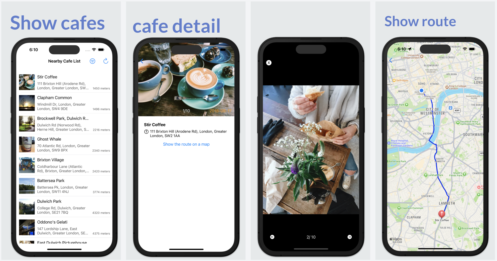

# CoffeeMap

* Without any third-party library.
This app allows users to use their location to find coffee venues nearby.
Users can find coffee venue information on the table view.

## Requirement
Users have to provide the location for this app in order to query the coffee venues data

## Instruction
You will need to sign up as a Foursquare developer and create an app in order to use their services. Please see [Foursquare](https://developer.foursquare.com/docs/places-api-getting-started) for more details. 
Please add your Foursquare API Key at
`~/CoffeeMap/CoffeeMap/Application/AppConfiguration.swift` 
Or search by keyword "// TODO: ADD API KEY HERE" in the project.  
Modify the method getAPIKey in the class AppConfiguration

## Features
### UI Implementation
- CafeListView: Present a list of cafe venues
- CafeDetailView: Present the detail of the cafe venue including images
- ImageViewer: A view that focuses on the pictures, users can zoom in for the detail of the photographs.
- CafeMapView: Present the route between the user and the cafe venue
### API Data Fetching
- Get cafe list by GET API https://api.foursquare.com/v3/places/search
  - Pagination by the cursor
  - Sort the list by distance or popularity
- Get cafe venues' images by GET API https://api.foursquare.com/v3/places/{fsqId}/photos
### Localized Content
- Used Extension protocol with enumeration to define and use localized strings.
### Test Implementation
- Unit testing
  - Implement dependency injection and mock dependencies to improve the testability of code.
### Image Cache
- Implement image cache by NSCache

### Technologies:
- Swift
- MVVM + Coordinator
- Interface builder(.xib)
- Clean Architecture
- POP (protocol LocallizedStringType)
- OOP
- MapKit
- Concurrency (await async)
- Unit testing
- Observable
- Image Cache (NSCache)
- Dependency Injection
- Adapter pattern (TableViewAdapter)
- Singleton pattern (Spinner)
